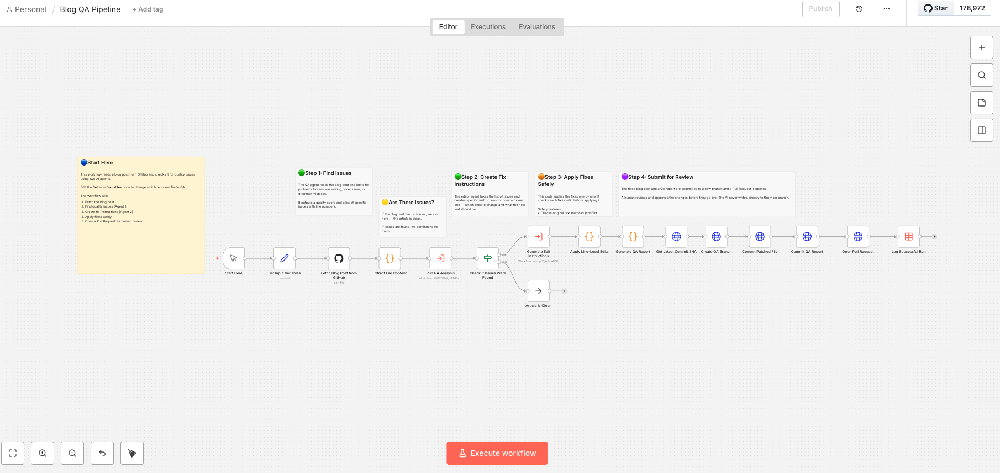
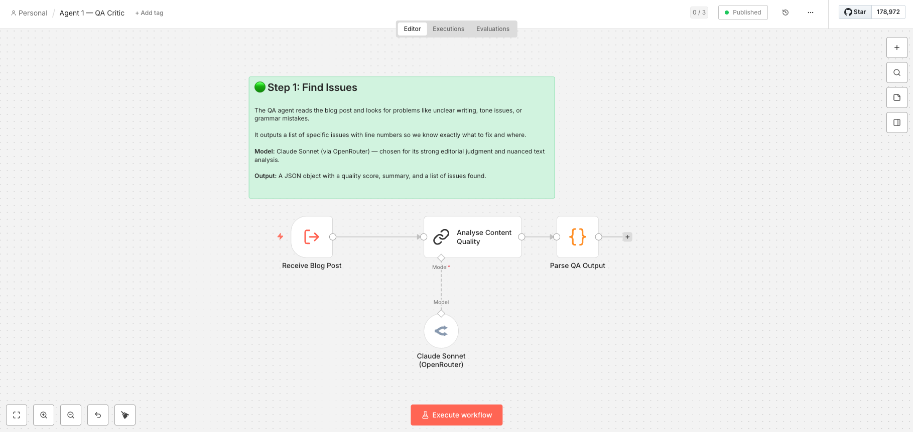
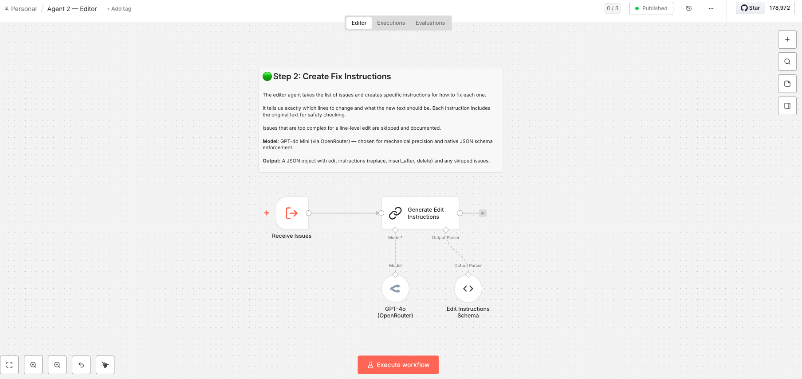
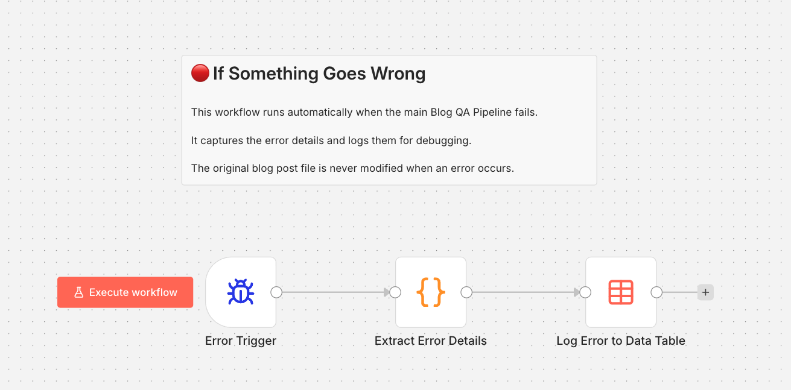
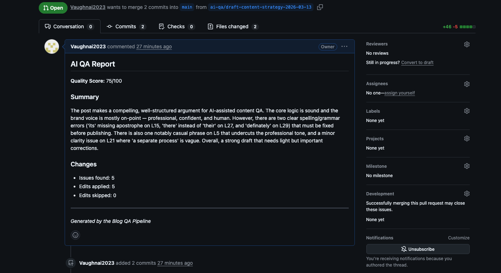
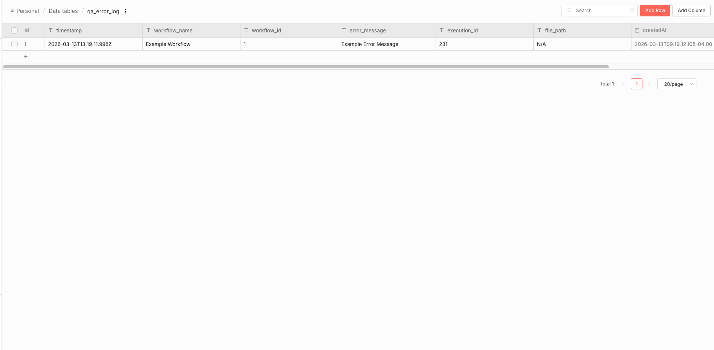

# Blog QA Pipeline — Two-Agent AI Quality Review for Markdown Blog Posts

An n8n automation that uses two AI agents to review a blog post stored in GitHub, apply targeted line-level fixes, and open a Pull Request for human approval. Built as a technical exercise for Longship Marketing.

---

## What It Does

1. **Reads** a Markdown blog post from a GitHub repository
2. **Agent 1 (QA Critic)** analyses the content for grammar, tone, clarity, readability, and structure issues — and scores it across 5 weighted dimensions
3. **Agent 2 (Editor)** converts each issue into a specific edit instruction (which line, what to change, what to change it to)
4. **Patch Engine** applies the edits safely to the original document, line by line, with conflict detection and safety checks
5. **Opens a Pull Request** on GitHub with the fixed blog post and a detailed QA report — a human reviews and approves before anything goes live

Nothing gets published without human approval. The AI suggests — the human decides.

---

## Architecture



```
Manual Trigger
       │
       ▼
Fetch blog post from GitHub
       │
       ▼
Add line number markers ([L1], [L2], etc.)
       │
       ▼
Agent 1 — QA Critic (Claude Sonnet)
  Finds issues, scores quality
       │
       ▼
Any issues found? ── No → Stop
       │
       ▼ Yes
Agent 2 — Editor (GPT-4o)
  Creates edit instructions
       │
       ▼
Patch Engine (JavaScript)
  Applies edits safely
       │
       ▼
Generate QA Report
       │
       ▼
Create branch → Commit files → Open PR
       │
       ▼
Log run to data table
```

---

## Screenshots

| | |
|---|---|
|  **Main Workflow** — The full pipeline from fetch to PR |  **Agent 1 — QA Critic** — Claude Sonnet analysing content |
|  **Agent 2 — Editor** — GPT-4o generating edit instructions |  **Error Handler** — Catches failures, logs to data table |
|  **Example PR** — A real Pull Request created by the pipeline |  **Error Log** — Captured failure in the error log table |

---

## Repository Structure

```
├── WRITEUP.md                          # Detailed write-up (task choice, design decisions, trade-offs)
├── README.md                           # This file
├── workflows/
│   ├── blog-qa-pipeline.json           # Main orchestrator workflow
│   ├── agent1-qa-critic.json           # Agent 1 sub-workflow
│   ├── agent2-editor.json              # Agent 2 sub-workflow
│   └── error-handler.json              # Error handler workflow
├── sample-content/
│   └── draft-content-strategy.md       # Test blog post with deliberate errors
├── assets/
│   ├── main-workflow.png               # Screenshot of main workflow canvas
│   ├── agent1-qa-critic.png            # Screenshot of Agent 1 sub-workflow
│   ├── agent2-editor.png               # Screenshot of Agent 2 sub-workflow
│   ├── error-handler.png               # Screenshot of error handler
│   ├── example-pr.png                  # Screenshot of a PR created by the pipeline
│   └── error-log.png                   # Screenshot of error log data table
```

---

## How to Set It Up

### What You Need

- **n8n** (self-hosted or cloud) — tested on n8n version 1.x
- **OpenRouter API key** — for AI model access (Claude Sonnet and GPT-4o)
- **GitHub Personal Access Token** — with repo read/write permissions

### Step 1: Import the Workflows

1. Open n8n
2. Go to **Workflows** in the left sidebar
3. Click the **three-dot menu (⋮)** → **Import from File**
4. Import each JSON file from the `workflows/` folder:
   - `blog-qa-pipeline.json` (main workflow)
   - `agent1-qa-critic.json` (Agent 1)
   - `agent2-editor.json` (Agent 2)
   - `error-handler.json` (Error Handler)

### Step 2: Set Up Credentials

You need three credentials in n8n:

1. **OpenRouter API credential**
   - Go to **Credentials** in the left sidebar → **Add Credential**
   - Search for "Header Auth" or the appropriate OpenRouter credential type
   - Add your OpenRouter API key
   - This is used by both Agent 1 and Agent 2

2. **GitHub API credential**
   - Add a GitHub credential with your Personal Access Token
   - This is used by the "Fetch Blog Post from GitHub" node and the commit nodes

3. **Header Auth credential (for GitHub HTTP requests)**
   - Some GitHub API calls use HTTP Request nodes instead of the native GitHub node
   - Add a Header Auth credential with `Authorization` as the header name and `Bearer YOUR_TOKEN` as the value
   - This is used by the branch creation, commit, and PR nodes

### Step 3: Update the Workflow IDs

The main workflow calls Agent 1 and Agent 2 as sub-workflows using their workflow IDs. After importing, the IDs will be different in your n8n instance.

1. Open the **Blog QA Pipeline** (main workflow)
2. Find the **"Run QA Analysis"** node → update the workflow ID to match your imported Agent 1
3. Find the **"Generate Edit Instructions"** node → update the workflow ID to match your imported Agent 2
4. In the main workflow's **Settings** (gear icon) → set the Error Workflow to your imported Error Handler

### Step 4: Connect Credentials to Nodes

After importing, you'll need to reconnect credentials to the nodes that use them:

**GitHub API credential** → 3 nodes:
- Fetch Blog Post from GitHub
- Commit Patched File
- Commit QA Report

**Header Auth credential** → 3 nodes:
- Get Latest Commit SHA
- Create QA Branch
- Open Pull Request

**OpenRouter credential** → 2 nodes (one in each sub-workflow):
- Agent 1's model node
- Agent 2's model node

---

## How to Run It

1. Open the **Blog QA Pipeline** workflow in n8n
2. Click **"Test Workflow"** (the play button)
3. Wait for the pipeline to complete (usually 30–60 seconds depending on AI response times)
4. Check your GitHub repository — you should see a new Pull Request with:
   - A title like `[AI QA] Edits for draft-content-strategy.md`
   - A body with the quality score and edit summary
   - Two committed files: the patched blog post and a QA report

---

## Credentials Used (Names Only)

| Credential | Type | Used By |
|---|---|---|
| OpenRouter API key | Header Auth / API Key | Agent 1, Agent 2 |
| GitHub account | GitHub API (PAT) | File fetch, commits, report commit |
| GitHub (Header Auth) | Header Auth | Branch creation, PR creation |

---

## For the Full Story

See [WRITEUP.md](WRITEUP.md) for:
- Why I chose this task
- All the key design decisions and the problems they solve
- How I refined the AI prompts over 4 iterations
- What's real vs simplified
- Known limitations and what I'd improve with more time
- Future extension ideas

---

*Built by Vaughn as part of the Longship Marketing n8n Automation Specialist technical exercise (March 2026)*
